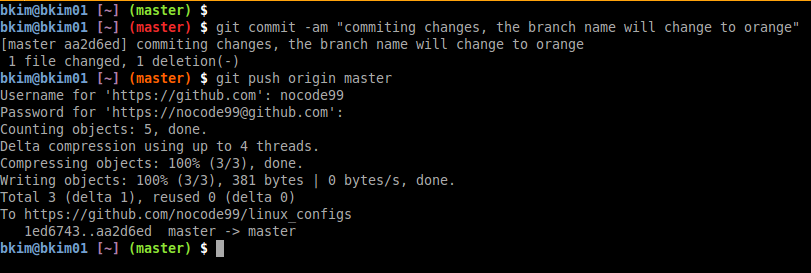

### Bash Highlighting For Git Branch and Status



If you are in a working git directory, this script will automatically set
color syntax highlighting for your PS1.  This typically will need to be added
in your ~/.bashrc or ~/.bash_profile (OSX). Typically, color mappings will need
to be escaped, but this cannot be done when you're using `echo` an output.  The
escapes `\[ \]` are done when assigning the contents to the PS1 environment
variable.

```bash
COLOR_RED="\033[0;31m"
COLOR_YELLOW="\033[0;33m"
COLOR_GREEN="\033[0;32m"
COLOR_PURPLE="\033[1;35m"
COLOR_ORANGE="\033[38;5;202m"
COLOR_BLUE="\033[34;5;115m"
COLOR_WHITE="\033[0;37m"
COLOR_RESET="\033[0m"
BOLD="$(tput bold)"

function git_color {
  local git_status="$(git status 2> /dev/null)"
  local branch="$(git rev-parse --abbrev-ref HEAD 2>/dev/null)"
  local git_commit="$(git --no-pager diff --stat origin/${branch} 2>/dev/null)" 
  if [[ ! $git_status =~ "working directory clean" ]]; then
    echo -e $COLOR_RED
  elif [[ $git_status =~ "Your branch is ahead of" ]]; then
    echo -e $COLOR_YELLOW
  elif [[ $git_status =~ "nothing to commit" ]] && \
      [[ ! -n $git_commit ]]; then
    echo -e $COLOR_GREEN
  else
    echo -e $COLOR_ORANGE
  fi
}

function git_branch {
  local git_status="$(git status 2> /dev/null)"
  local on_branch="On branch ([^${IFS}]*)"
  local on_commit="HEAD detached at ([^${IFS}]*)"

  if [[ $git_status =~ $on_branch ]]; then
    local branch=${BASH_REMATCH[1]}
    echo "($branch)"
  elif [[ $git_status =~ $on_commit ]]; then
    local commit=${BASH_REMATCH[1]}
    echo "($commit)"
  fi
}
#User and pwd
PS1_DIR="\[$BOLD\]\[$COLOR_BLUE\]\u@\h \[$BOLD\]\[$COLOR_PURPLE\][\w] "
PS1_GIT="\[\$(git_color)\]\[$BOLD\]\$(git_branch)\[$BOLD\]\[$COLOR_RESET\] "
PS1_END="\[$BOLD\]$ \[$COLOR_RESET\]"
PS1="${PS1_DIR}${PS1_GIT}${PS1_END}"
```
